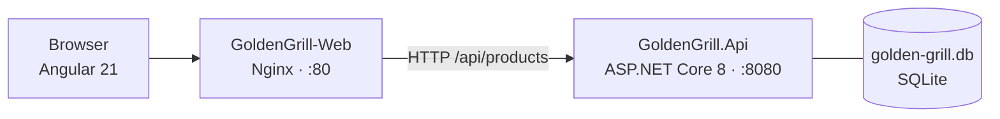

# Golden Grill — Burger Shop Platform

A full-stack burger shop platform built with a clean separation between a RESTful API and a modern reactive frontend. The backend exposes a product catalog over HTTP with full CRUD support and automatic database seeding. The frontend delivers a responsive, component-driven shopping experience. Both services are independently containerized and deployable to a Hostinger VPS via Docker.

---

## Tech Stack


---

## Why This Project

- **Two independently deployable services** — the API and the frontend live on separate Git branches, are built by separate Dockerfiles, and can be deployed, scaled, or replaced without touching each other.
- **Zero-config database bootstrapping** — EF Core migrations run automatically on API startup. A fresh container is fully seeded with product data in seconds, no manual SQL scripts required.
- **Standalone Angular architecture** — no NgModules. Every component is self-contained, tree-shakeable by default, and wired through the Angular Router without any shared module overhead.
- **Tailwind v4 via Vite plugin** — configured through `@tailwindcss/vite` and a single `@import "tailwindcss"` in the global stylesheet. No `tailwind.config.js` required; the compiler scans source files automatically.
- **Production-ready containers from day one** — both Dockerfiles use multi-stage builds to keep images lean. The API image is based on `aspnet:8.0`; the frontend is served by `nginx:alpine` with SPA routing and gzip compression configured out of the box.

---

## Architecture



---

## API Endpoints

Base URL: `http://localhost:5000/api`

| Method | Endpoint | Description | Response |
|--------|----------|-------------|----------|
| `GET` | `/products` | List all products | `200 Product[]` |
| `GET` | `/products/{id}` | Get product by ID | `200 Product` / `404` |
| `POST` | `/products` | Create new product | `201 Product` |
| `PUT` | `/products/{id}` | Update product | `204` / `404` |
| `DELETE` | `/products/{id}` | Delete product | `204` / `404` |

### Product Schema

```json
{
  "id": 1,
  "name": "Classic Smash",
  "description": "Double smash patty, cheddar, pickles, mustard",
  "price": 29.90,
  "imageUrl": "/images/classic-smash.jpg"
}
```

### Seed Data

Three burgers are seeded automatically on first run via EF Core `HasData`:

| # | Name | Description | Price |
|---|------|-------------|-------|
| 1 | Classic Smash | Double smash patty, cheddar, pickles, mustard | R$ 29.90 |
| 2 | BBQ Bacon Crunch | Crispy bacon, BBQ sauce, onion rings, cheddar | R$ 34.90 |
| 3 | Spicy Jalapeño | Jalapeños, pepper jack, chipotle mayo, lettuce | R$ 31.90 |

---

## Repository Structure

```text
golden-grill/
├── SPEC-KIT-SKILL.md                     # Full technical specification
│
├── GoldenGrill.Api/                      # branch: GoldenGrill.Api
│   ├── Controllers/
│   │   └── ProductsController.cs         # Full CRUD controller
│   ├── Data/
│   │   └── AppDbContext.cs               # EF Core context + HasData seed
│   ├── Models/
│   │   └── Product.cs                    # Domain model
│   ├── Migrations/                       # EF Core migrations (auto-applied on startup)
│   ├── Program.cs                        # DI, CORS, auto-migrate wiring
│   ├── GoldenGrill.Api.csproj            # EF Core 8 + SQLite + Design
│   └── Dockerfile                        # Multi-stage: sdk:8.0 → aspnet:8.0
│
└── GoldenGrill-Web/                      # branch: GoldenGrill-Web
    ├── src/
    │   ├── app/
    │   │   ├── app.ts                    # Root standalone component
    │   │   ├── app.routes.ts             # Angular Router config
    │   │   └── app.config.ts             # Application providers
    │   ├── styles.css                    # @import "tailwindcss"
    │   ├── main.ts                       # Bootstrap entry point
    │   └── index.html
    ├── vite.config.ts                    # @tailwindcss/vite plugin
    ├── angular.json
    ├── nginx.conf                        # SPA routing + gzip
    └── Dockerfile                        # Multi-stage: node:20-alpine → nginx:alpine
```

---

## Git Branch Strategy

Each concern lives on its own branch. `main` holds only shared documentation.

```
* GoldenGrill-Web   ← Angular 21 · Tailwind v4 · Nginx
| * GoldenGrill.Api ← ASP.NET Core 8 · EF Core · SQLite
|/
* main              ← README · SPEC-KIT-SKILL.md
```

| Branch | Responsibility |
|--------|----------------|
| `main` | Documentation, specification, Docker Compose (future) |
| `GoldenGrill.Api` | REST API, database, migrations, backend Dockerfile |
| `GoldenGrill-Web` | Angular frontend, Tailwind config, Nginx, frontend Dockerfile |

---

## How to Run Locally

### Option A — Docker (recommended)

```bash
# Clone the repo
git clone https://github.com/paulopacifico/golden-grill.git
cd golden-grill

# Run the API (from GoldenGrill.Api branch)
git checkout GoldenGrill.Api
docker build -t golden-grill-api ./GoldenGrill.Api
docker run -p 5000:8080 golden-grill-api

# In a second terminal — run the frontend (from GoldenGrill-Web branch)
git checkout GoldenGrill-Web
docker build -t golden-grill-web ./GoldenGrill-Web
docker run -p 4200:80 golden-grill-web
```

| Service | URL |
|---------|-----|
| API | `http://localhost:5000/api/products` |
| Frontend | `http://localhost:4200` |

---

### Option B — Local toolchain

#### Backend

```bash
git checkout GoldenGrill.Api
cd GoldenGrill.Api
dotnet run
```

The API starts on `http://localhost:5000`. SQLite database and migrations are applied automatically on first run.

#### Frontend

```bash
git checkout GoldenGrill-Web
cd GoldenGrill-Web
npm install
ng serve
```

The Angular dev server starts on `http://localhost:4200`.

---

## Engineering Highlights

### Automatic Database Migration and Seeding
`Program.cs` calls `db.Database.Migrate()` inside a scoped service at startup. On a fresh deployment the SQLite file is created, the schema is applied, and the three seed products are inserted — all before the first request is served. No manual setup step exists.

### Multi-Stage Docker Builds
Both services use multi-stage Dockerfiles to minimise final image size. The API build stage compiles and publishes with the full .NET SDK; the runtime stage copies only the published output into the lean `aspnet:8.0` image. The frontend build stage runs `ng build` in Node 20; the runtime stage copies only the compiled `dist/` output into `nginx:alpine`.

### CORS Configured for Cross-Origin Development
The API applies a permissive CORS policy in development (`AllowAnyOrigin`), enabling the Angular dev server on `:4200` to call the API on `:5000` without proxy configuration. The same policy can be tightened to a specific origin for production.

### Tailwind v4 with Zero Configuration
Tailwind v4 removes the need for a `tailwind.config.js`. Content scanning happens automatically via the Vite plugin. The entire setup is two lines: a `vite.config.ts` that registers `@tailwindcss/vite`, and `@import "tailwindcss"` in `styles.css`.

### Standalone Angular Components
The project uses Angular's modern standalone API throughout. There are no `NgModule` declarations. Components, pipes, and directives declare their own imports. The router is configured via `provideRouter` in `app.config.ts`, keeping bootstrap logic explicit and minimal.

---

## Deployment (Hostinger VPS)

```bash
# On the VPS
git clone https://github.com/paulopacifico/golden-grill.git
cd golden-grill

# Build and start both services
docker build -t golden-grill-api ./GoldenGrill.Api
docker build -t golden-grill-web ./GoldenGrill-Web

docker run -d -p 5000:8080 --name api golden-grill-api
docker run -d -p 80:80 --name web golden-grill-web
```

Configure the VPS Nginx reverse proxy to route your domain to the containers. A `docker-compose.yml` at the root of `main` is planned to simplify multi-container orchestration.

---

## Next Steps

- **Docker Compose** — single `docker compose up` to start both services from `main`
- **Product detail page** — Angular route `/products/:id` with full product view
- **Shopping cart** — client-side cart with Angular signals and localStorage persistence
- **Order flow** — checkout form, order entity, and order confirmation API
- **Authentication** — JWT-based auth with role-separated endpoints (admin vs. customer)
- **Image upload** — multipart endpoint to store burger images alongside the SQLite database
