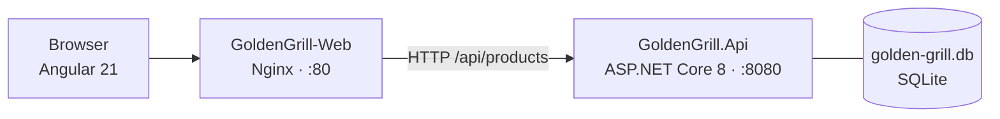

# Golden Grill - Burger Shop Platform

A full-stack burger shop platform built with a clean separation between a RESTful API and a modern reactive frontend. The backend exposes a product catalog over HTTP with full CRUD support and automatic database seeding. The frontend delivers a responsive, component-driven shopping experience. Both services are independently containerized and deployable to a Hostinger VPS via Docker.

## Tech Stack


## Why This Project

- **Two independently deployable services.** The API and the frontend live in separate folders, are built by separate Dockerfiles, and can be deployed, scaled, or replaced without touching each other.
- **Zero-config database bootstrapping.** EF Core migrations run automatically on API startup. A fresh container is fully seeded with product data in seconds, no manual SQL scripts required.
- **Standalone Angular architecture.** No NgModules. Every component is self-contained, tree-shakeable by default, and wired through the Angular Router without any shared module overhead.
- **Tailwind v4 via Vite plugin.** Configured through `@tailwindcss/vite` and a single `@import "tailwindcss"` in the global stylesheet. No `tailwind.config.js` required; the compiler scans source files automatically.
- **Production-ready containers from day one.** Both Dockerfiles use multi-stage builds to keep images lean. The API image is based on `aspnet:8.0` and the frontend is served by `nginx:alpine` with SPA routing and gzip compression configured out of the box.

## Architecture



## API Endpoints

Base URL: `http://localhost:5001/api`

| Method | Endpoint | Description | Response |
|--------|----------|-------------|----------|
| `GET` | `/products` | List all products | `200 Product[]` |
| `GET` | `/products/{id}` | Get product by ID | `200 Product` / `404` |
| `POST` | `/products` | Create new product | `201 Product` |
| `PUT` | `/products/{id}` | Update product | `204` / `404` |
| `DELETE` | `/products/{id}` | Delete product | `204` / `404` |

### Product Schema

```json
{
  "id": 1,
  "name": "Classic Smash",
  "description": "Double smash patty, cheddar, pickles, mustard",
  "price": 29.90,
  "imageUrl": "/images/classic-smash.jpg"
}
```

### Seed Data

Three burgers are seeded automatically on first run via EF Core `HasData`:

| # | Name | Description | Price |
|---|------|-------------|-------|
| 1 | Classic Smash | Double smash patty, cheddar, pickles, mustard | R$ 29.90 |
| 2 | BBQ Bacon Crunch | Crispy bacon, BBQ sauce, onion rings, cheddar | R$ 34.90 |
| 3 | Spicy Jalapeño | Jalapeños, pepper jack, chipotle mayo, lettuce | R$ 31.90 |

## Repository Structure

```text
golden-grill/
├── GoldenGrill.Api/
│   ├── Controllers/
│   │   ├── ProductsController.cs         # Full CRUD controller
│   │   └── OrdersController.cs           # Order placement and retrieval
│   ├── Data/
│   │   └── AppDbContext.cs               # EF Core context + HasData seed
│   ├── Models/
│   │   ├── Product.cs                    # Domain model
│   │   ├── Order.cs                      # Order + OrderItem entities
│   │   └── OrderDtos.cs                  # Request/response records
│   ├── Migrations/                       # EF Core migrations (auto-applied on startup)
│   ├── wwwroot/images/                   # Static product images
│   ├── Program.cs                        # DI, CORS, auto-migrate wiring
│   ├── GoldenGrill.Api.csproj            # EF Core 8 + SQLite + Design
│   └── Dockerfile                        # Multi-stage: sdk:8.0 to aspnet:8.0
│
└── GoldenGrill-Web/
    ├── src/
    │   ├── app/
    │   │   ├── core/
    │   │   │   ├── product.model.ts
    │   │   │   ├── order.model.ts
    │   │   │   └── services/
    │   │   │       ├── product.service.ts
    │   │   │       ├── cart.service.ts
    │   │   │       └── order.service.ts
    │   │   ├── features/
    │   │   │   ├── menu/                 # Product grid
    │   │   │   └── confirmation/         # Post-order confirmation screen
    │   │   ├── shared/
    │   │   │   ├── header/               # Branded header with cart trigger
    │   │   │   └── cart/                 # Cart sidebar with order placement
    │   │   ├── app.ts                    # Root standalone component
    │   │   ├── app.routes.ts             # / and /confirmation
    │   │   └── app.config.ts             # provideRouter + provideHttpClient
    │   ├── environments/
    │   │   ├── environment.ts            # apiUrl: http://localhost:5001/api
    │   │   └── environment.prod.ts       # apiUrl: /api (relative, for Docker)
    │   ├── styles.css                    # @import "tailwindcss"
    │   ├── main.ts                       # Bootstrap entry point
    │   └── index.html
    ├── public/logo.png                   # Header brand asset
    ├── vite.config.ts                    # @tailwindcss/vite plugin
    ├── angular.json
    ├── nginx.conf                        # SPA routing + gzip
    └── Dockerfile                        # Multi-stage: node:20-alpine to nginx:alpine
```

## Git Branch Strategy

All development happens on `main`. The API and the frontend live in sibling folders within a single tree, with separate Dockerfiles so each service still builds and deploys independently.

The historical `GoldenGrill.Api` and `GoldenGrill-Web` feature branches have been consolidated into `main`. They are kept on the remote for reference only and should not receive new commits.

## How to Run Locally

### Option A: Docker Compose (recommended)

```bash
git clone https://github.com/paulopacifico/golden-grill.git
cd golden-grill
docker compose up --build
```

The frontend is published on port 80 and Nginx reverse-proxies `/api/*` to the API container over the internal Docker network. SQLite data is persisted in a named volume (`api-data`) so it survives container rebuilds.

| Service | URL |
|---------|-----|
| Frontend | `http://localhost` |
| API (through Nginx) | `http://localhost/api/products` |

The API container is intentionally not exposed to the host in this setup. To hit it directly from the host for debugging, run the API with the local toolchain (Option B) instead, or add a `ports` mapping to the `api` service.

### Option B: Local toolchain

**Backend**

```bash
cd GoldenGrill.Api
dotnet run
```

The API starts on `http://localhost:5001`. SQLite database and migrations are applied automatically on first run.

**Frontend**

```bash
cd GoldenGrill-Web
npm install
ng serve
```

The Angular dev server starts on `http://localhost:4200`.

## Engineering Highlights

### Automatic Database Migration and Seeding
`Program.cs` calls `db.Database.Migrate()` inside a scoped service at startup. On a fresh deployment the SQLite file is created, the schema is applied, and the three seed products are inserted before the first request is served. No manual setup step exists.

### Multi-Stage Docker Builds
Both services use multi-stage Dockerfiles to minimise final image size. The API build stage compiles and publishes with the full .NET SDK; the runtime stage copies only the published output into the lean `aspnet:8.0` image. The frontend build stage runs `ng build` in Node 20; the runtime stage copies only the compiled `dist/` output into `nginx:alpine`.

### CORS Configured for Cross-Origin Development
The API reads allowed origins from `appsettings.json` under `Cors:AllowedOrigins`, set to `http://localhost:4200` for development. This lets the Angular dev server call the API on `:5001` without proxy configuration. Adding a production origin requires only a config change, no code change.

### Tailwind v4 with Zero Configuration
Tailwind v4 removes the need for a `tailwind.config.js`. Content scanning happens automatically via the Vite plugin. The entire setup is two lines: a `vite.config.ts` that registers `@tailwindcss/vite`, and `@import "tailwindcss"` in `styles.css`.

### Standalone Angular Components
The project uses Angular's modern standalone API throughout. There are no `NgModule` declarations. Components, pipes, and directives declare their own imports. The router is configured via `provideRouter` in `app.config.ts`, keeping bootstrap logic explicit and minimal.

## Deployment (Hostinger VPS)

```bash
# On the VPS
git clone https://github.com/paulopacifico/golden-grill.git
cd golden-grill
docker compose up -d --build
```

Both services come up under the supplied `docker-compose.yml`. The frontend listens on port 80; Nginx inside the `web` container reverse-proxies `/api/*` to the `api` container. The SQLite database is persisted in the `api-data` named volume.

For TLS, terminate HTTPS on the host's Nginx (or Traefik / Caddy) and forward to the `web` container on port 80.

## Next Steps

- **JWT authentication** to protect product mutations and back an admin panel
- **Product detail page** with Angular route `/products/:id`
- **Cart persistence** with `sessionStorage` so a refresh does not empty the cart
- **Image upload** with a multipart endpoint to store burger images
- **CI** to build the API, build the Angular app, and exercise the compose stack on every push
